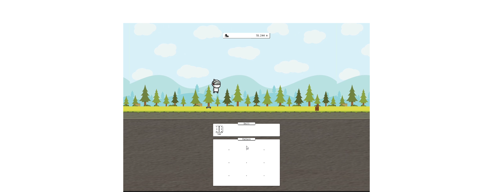
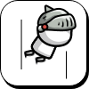
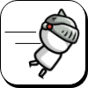
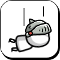
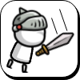
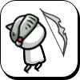
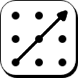

# PatternRUN
모바일 환경에서 패턴 입력으로 기술을 발동하는 러닝 액션 게임

## 프로젝트 설명

모바일 환경에서 새로운 Input 기능을 추가하는 프로젝트로써 Pattern Input 기능을 통한 첫번쨰 프로젝트입니다.
Pattern을 입력하여 장애물을 피하거나, 부수면서 최고 점수에 도달하는 게임으로 쉽고 직관적인 게임으로 제작됐습니다.

* InputPad를 이용하여 캐릭터 동작을 컨트롤합니다.
* 이동 거리에 따라 캐릭터 상태가 점점 빨라집니다.
* 장애물이 발생하는 스케줄링 시스템에 의해 랜덤으로 자동 생성됩니다.
* 리플레이을 원할 시 Ads 후 리플레이 할 수 있습니다.

---
Nammu - [DreamAntDev](https://github.com/DreamAntDev)  
Email : nammu8395@gmail.com  
GitHub Issue : https://github.com/mod157/ipp.unity/issues  

---

## 기능 목록
|Icon|설명|
|---|---|
|{: width="36" height="36"} {: width="36" height="36"}|캐릭터가 점프합니다. 장애물을 뛰어 넘을 수 있습니다.|
|{: width="36" height="36"} {: width="36" height="36"}|캐릭터가 대쉬합니다. 장애물을 빠르게 지나갈 수 있습니다.|
|{: width="36" height="36"} {: width="36" height="36"}|캐릭터가 앉습니다. 장애물을 지나칠 수 있습니다.|
|{: width="36" height="36"} {: width="36" height="36"}|캐릭터 검을 소지하고 있을 때 공격합니다. 공격에 닿은 장애물을 부숩니다.|
|{: width="36" height="36"} {: width="36" height="36"}|캐릭터가 활을 소지 할 시 화살을 쏩니다.  화살에 닿은 장애물을 부숩니다.|

## 라이선스

This library is under the [MIT](https://github.com/mod157/DreamAntDev/PatternRun?tab=MIT-1-ov-file) License.
